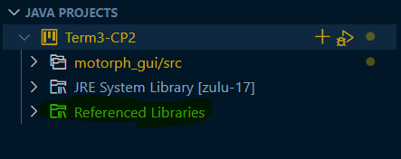

# Term3-CP2

  

Motor-PH employee app with GUI using Javafx

## Getting Started

Welcome to the VS Code Java world. Here is a guideline to help you get started to taking tour in our project using Visual Studio Code.

## Folder Structure

The workspace contains two folders by default, where:

- `motorph_gui`: is the main folder where you can find next 2 folder
- `src`: the folder where you can find the main app App.java
- `lib`: the folder to maintain dependencies

Meanwhile, the compiled output files will be generated in the `bin` folder by default.

## Dependency Management
This App needs JDK and java fx
You can download it [Here](https://drive.google.com/file/d/1hmO0h21K1613X3hN5WwYp5xqPRIGhqth/view?usp=sharing).

Download this Repository and unzip
Then you can already open the whole project folder named `Term3-CP2` in vscode 

 
This App needs opencsv which it included in the files here the folder name is opencsv_jar_files add them to the Referenced Library 

 

